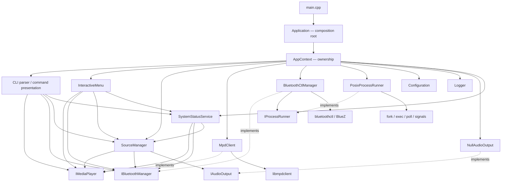

# Архитектура x308-headunit

## 1. Статус документа

Этот документ фиксирует целевую архитектуру и фактическое состояние проекта.
Если описание цели расходится с кодом, текущее расхождение перечислено в разделе
«Known architectural deviations» и не считается уже реализованной функцией.

Архитектура проекта — **модульный монолит**. Система собирается в один основной
исполняемый файл `x308-headunit`; внутренние модули разделяются границами
ответственности и C++-интерфейсами, а не отдельными процессами или сервисами.

Целевая платформа:

- Rock Pi 4B Plus;
- Debian 12 ARM64;
- C++20 и CMake;
- ручной запуск во время разработки;
- запуск через systemd в финальной системе;
- консольный интерфейс сейчас и GUI в будущем.

Приоритеты в порядке важности: надёжность в автомобиле, быстрый запуск,
предсказуемость, простая диагностика, заменяемость инфраструктурных реализаций и
минимум скрытой магии. Новые абстракции вводятся только под подтверждённую
необходимость.

## 2. Назначение и границы системы

`x308-headunit` должен стать единым приложением мультимедийной системы Jaguar
XJR X308. В текущем коде реализованы управление MPD, управление BlueZ через
`bluetoothctl`, переключение источника, конфигурация, логирование, CLI и
интерактивное меню.

Запланированы, но **не реализованы** в текущем приложении:

- CarPlay backend;
- GUI и решение об IPC;
- Helix DSP, SPDIF и другие реальные audio-output реализации;
- GPIO, кнопки, энкодеры и экран;
- `BluezDbusManager`;
- база постоянного состояния и система удалённых обновлений.

Выбор Qt или Web GUI, IPC, финального аудиобэкенда, протокола Helix DSP и GPIO
library намеренно отложен. Для них сохраняются только уже оправданные точки
расширения.

## 3. Общая схема



`Application` является единственным production composition root. Он создаёт
объекты, передаёт владение в `AppContext` и связывает их явными constructor
dependencies. Dependency injection framework, service locator, глобальный
контейнер и singleton не используются.

## 4. Логические слои

### 4.1 Presentation

Компоненты:

- `CliParser`;
- `Cli` — CLI-диспетчеризация и форматирование вывода;
- `InteractiveMenu`;
- будущий GUI.

Слой преобразует пользовательский ввод в вызовы прикладных сервисов, проверяет
форму аргументов, форматирует собственные модели и переводит результат операции
в пользовательское сообщение и exit code.

Presentation не должен вызывать `bluetoothctl`, libmpdclient, ALSA, systemd или
читать `/proc` напрямую. CLI, меню и будущий GUI должны пользоваться одними и
теми же интерфейсами и прикладными сценариями.

### 4.2 Application

Компоненты:

- `SourceManager`;
- `SystemStatusService`;
- сценарии координации источников;
- composition root `Application` — только в части создания, связывания,
  выбора режима и завершения объектов.

Слой оркестрирует модули через интерфейсы. Он не разбирает протоколы MPD или
BlueZ и не содержит platform-specific process management.

### 4.3 Domain interfaces and models

Интерфейсы:

- `IMediaPlayer`;
- `IBluetoothManager`;
- `IAudioOutput`;
- `IDspController`;
- `IInputController`.

Собственные модели находятся в `Models.hpp`: `Result`, `AudioSource`,
`PlaybackState`, `Track`, `MediaStatus`, `LibraryEntry`, `BluetoothDevice` и
`BluetoothStatus`. Инфраструктурные типы библиотек не должны попадать в эти
модели или интерфейсы.

### 4.4 Infrastructure

Компоненты:

- `MpdClient` и libmpdclient;
- `BluetoothCtlManager` и `bluetoothctl`;
- `PosixProcessRunner` и Linux process API;
- `ConfigurationLoader` и файловая система;
- `Logger` и стандартные потоки;
- минимальные hardware-заглушки.

Infrastructure реализует доменные интерфейсы и знает детали Linux и внешних
протоколов. Остальные слои не должны зависеть от конкретного механизма
`bluetoothctl` или C-типов libmpdclient.

Желаемое направление зависимостей:

```text
Presentation -> Application -> Domain interfaces/models <- Infrastructure
```

Composition root вправе знать конкретные классы, поскольку именно он выбирает
реализации, но не должен переносить их бизнес-логику внутрь себя.

## 5. Composition root и жизненный цикл

`Application::run()` является единственным production composition root.
`AppContext` владеет типизированной конфигурацией, logger, process runner,
MPD/Bluetooth adapters, audio output, `SourceManager`, `SystemStatusService`,
`Cli` и `InteractiveMenu`. Контекст не является service locator: он доступен
только `Application`, а модули получают конкретные зависимости напрямую.

Жизненный цикл намеренно линейный:

```text
Created -> Initialized -> Running -> Stopping -> Stopped
```

Этапы запуска:

1. разобрать общие параметры запуска;
2. загрузить типизированную конфигурацию;
3. настроить логирование;
4. создать process runner и инфраструктурные адаптеры;
5. создать `SourceManager`, `SystemStatusService` и presentation-компоненты;
6. выбрать CLI или интерактивный режим;
7. корректно уничтожить все объекты и дочерние процессы.

Обычный старт не должен инициировать Bluetooth scan, pairing, подключение
телефона, MPD update или тяжёлую диагностику. Все длительные операции должны
быть явно запрошены и иметь ограничение времени.

Единый `shutdown()` переводит приложение в `Stopping`, уничтожает `AppContext`
и затем переводит его в `Stopped`. Порядок владения гарантирует, что
presentation и application services уничтожаются до infrastructure adapters,
а `BluetoothCtlManager` завершает принадлежащий ему pairing agent до освобождения
общего `PosixProcessRunner`.

`Application` не разбирает команды модулей, не форматирует их вывод, не знает
протокол MPD или формат `bluetoothctl`. Разбор и dispatch команд находятся в
`Cli`, а Application выбирает только CLI или интерактивный режим.

## 6. SourceManager

`SourceManager` — единственный прикладной компонент, который хранит активный
источник и координирует его переключение.

Текущий публичный API компактен:

```cpp
AudioSource activeSource() const noexcept;
Result setSource(AudioSource source);
```

Поддерживаемые значения модели: MPD, Bluetooth и зарезервированный CarPlay.
CarPlay сейчас возвращает ошибку «not implemented» и не имеет backend.

При переходе на MPD менеджер должен освободить Bluetooth-аудио, выбрать MPD в
`IAudioOutput` и подготовить MPD. При переходе на Bluetooth он ставит MPD на
паузу, освобождает его output, переключает `IAudioOutput` и активирует
Bluetooth. Адаптер Bluetooth при обычной смене источника не выключается.

`SourceManager` не занимается pairing, scan, MPD-библиотекой, GPIO или DSP. Он
зависит от `IMediaPlayer`, `IBluetoothManager` и `IAudioOutput`. Широкий
`IBluetoothManager` допустим на текущем этапе; разделение на device-management
и audio-source интерфейсы возможно только при реальной необходимости.

## 7. MPD module

`MpdClient` реализует `IMediaPlayer` и владеет всеми обращениями к
libmpdclient. Он создаёт ограниченное по времени соединение на операцию,
преобразует MPD status/song/entity в собственные модели и освобождает C-объекты
через RAII. Read-only status повторяется один раз только при немедленном
transient `Timeout` короче 50 мс; полноценный timeout не запускает retry и не
удваивает длительное ожидание недоступного MPD.

Ответственность модуля:

- доступность, playback status и текущий трек;
- play, pause, toggle, stop, next и previous;
- очередь и библиотека;
- добавление URI/папки;
- random, repeat и явно запрошенный database update;
- преобразование ошибок libmpdclient.

Модуль не выбирает глобальный источник, не монтирует носители, не управляет
службой MPD и не конфигурирует ALSA. Полный update не выполняется при старте.

## 8. Bluetooth module

`BluetoothCtlManager` — временная infrastructure-реализация
`IBluetoothManager`. Она отвечает за power/status, scan, устройства,
pair/trust/connect/remove, pairing mode, auto-connect, проверку MAC, тайм-ауты и
разбор вывода `bluetoothctl`. Paired, trusted и connected списки запрашиваются
отдельными read-only filters. Cached disconnected device не считается available:
available устанавливается только при connected state или актуальном RSSI.

Обычные команды передаются как executable и отдельный argv, без shell-строк.
Парсеры `show`, `devices` и `info` находятся внутри Bluetooth-модуля. Ручной
auto-connect получает ordered trusted list и делает не более трёх bounded
попыток подключения по пять секунд. Попытки логируются на английском через
инжектированный `Logger`; бесконечного retry нет.

Будущая `BluezDbusManager` должна реализовать тот же доменный контракт. Её
подстановка не должна требовать изменений в `SourceManager`, CLI или меню;
composition root изменит только выбранную реализацию.

Bluetooth-модуль не форматирует CLI, не выполняет MPD-команды и не решает,
какой глобальный источник должен быть активен.

## 9. ProcessRunner

`IProcessRunner` принимает executable, отдельный список аргументов и timeout.
`PosixProcessRunner` реализует:

- `fork`/`execvp` без shell;
- отдельные pipe для stdout и stderr;
- exit code и признак timeout;
- неблокирующее чтение через `poll`;
- ограничение объёма захваченного вывода;
- отдельную process group;
- `SIGTERM`, grace period и `SIGKILL`;
- закрытие pipe и ожидание дочернего процесса.

Запрещены `system()`, `popen()`, `sh -c`, `bash -c` и API с готовой shell-командой.
ProcessRunner не знает о Bluetooth, MPD и формате вывода вызываемой программы.

Целевой контракт может со временем получить `ProcessRequest` с optional working
directory/environment и расширенный `ProcessResult` с signal/duration. Такие
поля не вводятся до появления пользователя этих данных.

## 10. Configuration и logging

`ConfigurationLoader` возвращает типизированные `ApplicationConfig`,
`MpdConfig`, `BluetoothConfig`, `AudioConfig` и `LoggingConfig`. Приоритет поиска:

1. путь из `--config`;
2. `/etc/x308-headunit/config.toml`;
3. `config/config.toml` относительно рабочего каталога;
4. значения по умолчанию.

TOML-объекты не передаются в прикладные модули. Критические ошибки явного файла
конфигурации представлены `ConfigurationError`; обычные состояния модулей не
должны использовать исключения.

Технические логи пишутся на английском в стандартные потоки и естественно
попадают в journal при systemd. Постоянный лог-файл не создаётся. В лог не
выводятся секреты, полная конфигурация или большие дампы внешних команд.
Пользовательский CLI-ответ не является техническим логом.

## 11. Hardware interfaces

`IAudioOutput`, `IDspController` и `IInputController` — минимальные точки
расширения для будущего оборудования. Сейчас имеются только
`NullAudioOutput`, `NullDspController` и `NullInputController`; они не заявляют
работу отсутствующего железа.

Реальные SPDIF, Helix DSP, GPIO, кнопки, энкодеры и экран не проектируются
заранее. Их появление требует отдельного архитектурного решения и аппаратной
проверки.

На проверенной Rock Pi MPD и `bluealsa-aplay` настроены на один ALSA PCM
`plughw:CARD=rockchipes8316,DEV=0`. BlueALSA 4.0.0 запущен только с A2DP Source
и Sink, без SCO/HFP profiles. Одновременно активны PipeWire, PipeWire Pulse и
WirePlumber. Приложение не меняет эти system services; выбор единственного
audio backend требует отдельного системного решения и плана отката.

## 12. SystemStatus

`SystemStatusService` реализует read-only агрегацию лёгких данных от
`IMediaPlayer`, `IBluetoothManager`, `SourceManager`, storage и малых Linux
probes. Он возвращает собственный `SystemStatusReport` с данными приложения,
системы, `/mnt/music`, MPD, Bluetooth и активного источника.

Он не должен выполнять scan, pairing, database update, переключать сервисы или
блокировать запуск. Presentation получает готовый `SystemStatusReport`, а не
читает Linux-источники напрямую. CLI и интерактивное меню используют один
`SystemStatusPresenter`.

Бюджет сбора — менее 200 мс. SystemStatus использует те же экземпляры MPD и
Bluetooth adapters, что CLI, без повторного создания сервисов. Read-only
`MpdClient::status()` ограничен 180 мс, а единственный `bluetoothctl show` —
100 мс. Независимые module probes выполняются параллельно в двух владеемых
`jthread` и обязательно join-ятся до возврата отчёта. Фактическая длительность
входит в отчёт и проверяется integration-тестом.

## 13. Модели и ошибки

Конечные множества состояний представляются enum, например `AudioSource` и
`PlaybackState`. Внешние C-типы и строки протокола преобразуются на границе
infrastructure.

Целевая модель ошибки должна различать:

- категорию;
- пользовательское сообщение;
- техническое сообщение;
- exit code, если он применим.

Ожидаемые состояния — недоступный MPD, выключенный Bluetooth, пустая очередь,
отсутствующее устройство — возвращаются как результат или status, а не как
исключения. Исключения допустимы для критической конфигурации, невозможности
создать приложение и нарушения инвариантов.

## 14. Конкурентность и завершение

Базовая модель исполнения синхронная. Общий thread pool и detached threads
запрещены. Любая фоновая операция обязана иметь владельца, отмену, ограничение
времени и явное завершение.

Текущий ProcessRunner использует `poll`, а не фоновые потоки. SystemStatus
параллельно выполняет два независимых bounded probe в локальных `jthread`;
потоки имеют владельца и join до возврата результата. Временный pairing agent
принадлежит `BluetoothCtlManager`, имеет ограниченный срок жизни и
останавливается при уничтожении владельца.

## 15. Стратегия тестирования

### Unit tests

- быстрые и детерминированные;
- без root, сети, MPD и Bluetooth hardware;
- используют fake/mock для интерфейсов и `IProcessRunner`;
- проверяют configuration, CLI parsing, SourceManager, преобразование MPD
  models, MAC validation, парсинг `bluetoothctl`, available semantics,
  auto-connect order/timeouts и ошибки, а также агрегацию и presentation
  системного статуса;
- отдельная process fixture проверяет stdout/stderr, timeout, process group и
  закрытие унаследованных pipe.

### Safe integration tests

- включаются CMake-опцией `X308_ENABLE_INTEGRATION_TESTS`;
- читают реальный MPD status/current, queue и library, проверяют `/mnt/music` и
  ошибку неизвестного library path;
- выполняют только безопасные `bluetoothctl show`, `devices Trusted` и `info`;
- проверяют полный read-only `SystemStatusReport` и бюджет менее 200 мс;
- имеют timeout;
- не запускают scan/pairing и не меняют очередь или системную конфигурацию.

### Destructive hardware tests

Pairing, scan, connect/disconnect, удаление устройства, изменение реальной
очереди и аудиопереключение относятся к отдельной ручной категории. Они не
должны входить в обычный CTest-набор и требуют явного решения пользователя.

## 16. Запрещённые зависимости и паттерны

В проект не вводятся:

- микросервисы и отдельный демон на каждый модуль;
- event bus без подтверждённой необходимости;
- dependency injection framework, service locator или singleton services;
- God Object и бизнес-логика в presentation/composition root;
- глобальное изменяемое состояние;
- shell command strings и скрытые sudo-вызовы;
- бесконечные операции без отмены;
- detached threads;
- C-типы libmpdclient в публичном доменном API;
- parsing `bluetoothctl` за пределами Bluetooth infrastructure;
- прямые системные вызовы из CLI, меню или GUI;
- наследование и отдельные классы на каждую мелкую операцию без необходимости.

## 17. Процесс изменения архитектуры

Архитектура не меняется молча. Если задача требует нового слоя, ключевого
интерфейса, изменения направления зависимостей, фонового процесса, демона или
аудиостека, работа начинается с предложения:

1. описать исходную проблему;
2. предложить изменение;
3. перечислить разумные альтернативы;
4. объяснить последствия и миграцию;
5. получить подтверждение пользователя;
6. обновить этот документ вместе с подтверждённой реализацией.

Каждая законченная реализация должна собираться, проходить соответствующие
тесты и оформляться отдельным Git-коммитом.

## 18. Known architectural deviations

Ниже перечислены факты текущего кода. Для их исправления нужны отдельные
подтверждённые задачи.

1. **CLI и InteractiveMenu частично дублируют сценарии и форматирование.** Оба
   компонента самостоятельно сопоставляют команды с методами модулей. Общего
   набора application use cases пока нет. Выделение такого слоя требует
   отдельной задачи, чтобы не создать преждевременную абстракцию.

2. **Pairing agent обходит `IProcessRunner`.** Вложенный `AgentProcess` внутри
   `BluetoothCtlManager` напрямую использует `fork`/`execlp`, process group и
   сигналы. Жизненный цикл ограничен и безопасно завершается, но process
   management продублирован вне общего runner. Поддержка управляемого
   persistent process потребует осознанного расширения контракта ProcessRunner.

3. **Активное Bluetooth-аудиоустройство сейчас не определяется.** Безопасная
   реализация `status()` выполняет только `bluetoothctl show`, поэтому поле
   `BluetoothStatus::activeAudioDevice` остаётся пустым. Как следствие,
   `releaseAudio()` не может обнаружить и отключить уже подключённый stream, а
   переход Bluetooth → MPD пока не гарантирует реальное освобождение output.
   BlueALSA D-Bus PCM является более надёжным источником этого состояния, но его
   интеграция не относится к bluetoothctl backend.

4. **Модель ошибок упрощена.** `Result` содержит только `success` и одну строку,
   а некоторые query API передают ошибку через `lastError()`. Категория,
   разделённые user/technical messages и связанный exit code ещё не
   моделируются.

5. **В публичном `MpdClient.hpp` есть лишняя декларация `struct mpd_song`.** Она
   не используется публичным API, но имя C-типа libmpdclient формально попадает
   в публичный infrastructure-заголовок. Доменные интерфейсы и модели при этом
   остаются чистыми.

6. **Logger имеет только четыре уровня.** Реализованы `debug`, `info`, `warning`
   и `error`; отсутствуют `trace` и `critical`. Logger теперь имеет явного
   владельца в `AppContext` и не использует глобальное изменяемое состояние.

7. **Configuration parser поддерживает только используемое подмножество TOML.**
   Он корректно обрабатывает текущие простые секции/строки/числа/bool, но не
   является полной TOML-реализацией. Файл реализации физически находится в
   `src/app`, хотя логически относится к infrastructure.

8. **Переключение источника не имеет rollback.** `SourceManager` обновляет
    `activeSource_` только после полного успеха, но при ошибке посередине уже
    выполненные side effects не компенсируются. Стратегия восстановления требует
    отдельного решения с учётом реального ALSA/BlueALSA поведения.

9. **Graceful shutdown по SIGINT/SIGTERM ещё не интегрирован.** Единый shutdown
   покрывает все управляемые пути возврата, ошибки и разрушение `Application`,
   но отдельная signal-aware остановка для будущего запуска через systemd
   требует цикла событий или другого механизма прерывания синхронного CLI.

10. **AVRCP не представлен в доменном API.** BlueZ объявляет AVRCP Target и
    предоставляет deprecated `MediaControl1`; player object/metadata появляется
    только при подключённом телефоне. Bluetoothctl backend приложения не умеет
    надёжно выполнять transport commands и читать metadata. Для этого нужен
    отдельный ограниченный BlueZ D-Bus этап, а не фиктивные CLI-команды.

11. **Pairing mode CLI не является долговечным session owner.** В интерактивном
    меню pairing agent живёт до отключения режима или выхода. Одноразовый CLI
    процесс завершается сразу после команды, поэтому для входящего pairing
    следует использовать интерактивный сценарий; `pair <MAC>` остаётся явно
    запрошенной bounded операцией со своим agent.

## 19. Карта исходных файлов

```text
include/x308/
  App.hpp                     Application lifecycle and composition root
  AppContext.hpp              explicit ownership of application services
  Interfaces.hpp              domain interfaces
  Models.hpp                  domain/application models
  SourceManager.hpp           application orchestration
  SystemStatusReport.hpp      read-only diagnostic model
  SystemStatusService.hpp     application status aggregation
  MpdClient.hpp               MPD infrastructure adapter
  BluetoothCtlManager.hpp     Bluetooth infrastructure adapter
  ProcessRunner.hpp           process infrastructure contract
  Configuration.hpp           typed configuration contract
  InteractiveMenu.hpp         presentation
  Cli.hpp                     argument parser and injected CLI dispatcher
  SystemStatusPresenter.hpp   shared CLI/menu status formatting
src/
  app/App.cpp                 composition root, lifecycle and shutdown
  app/AppContext.cpp          owned application context destruction
  app/Configuration.cpp       configuration loading/parsing
  app/Logger.cpp              terminal/journal-friendly logging
  app/SystemStatusService.cpp read-only status aggregation and Linux probes
  cli/                        CLI, menu and shared status presentation
  source/SourceManager.cpp    source switching
  mpd/MpdClient.cpp           libmpdclient boundary
  bluetooth/                  bluetoothctl boundary
  system/                     process runner and hardware stubs
tests/
  unit/                       deterministic tests and process fixture
  integration/                opt-in safe host checks
```
