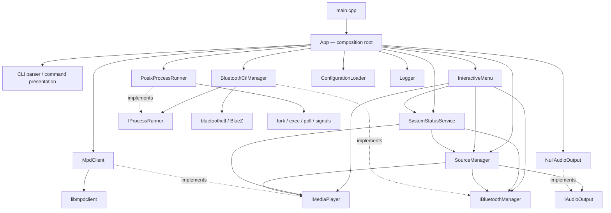

# Архитектура x308-headunit

## 1. Статус документа

Этот документ фиксирует целевую архитектуру и фактическое состояние проекта на
коммите `3533b8b` (`Implement safe Bluetooth process management`). Если описание
цели расходится с кодом, текущее расхождение перечислено в разделе
«Known architectural deviations» и не считается уже реализованной функцией.

Архитектура проекта — **модульный монолит**. Система собирается в один основной
исполняемый файл `x308-headunit`; внутренние модули разделяются границами
ответственности и C++-интерфейсами, а не отдельными процессами или сервисами.

Целевая платформа:

- Rock Pi 4B Plus;
- Debian 12 ARM64;
- C++20 и CMake;
- ручной запуск во время разработки;
- запуск через systemd в финальной системе;
- консольный интерфейс сейчас и GUI в будущем.

Приоритеты в порядке важности: надёжность в автомобиле, быстрый запуск,
предсказуемость, простая диагностика, заменяемость инфраструктурных реализаций и
минимум скрытой магии. Новые абстракции вводятся только под подтверждённую
необходимость.

## 2. Назначение и границы системы

`x308-headunit` должен стать единым приложением мультимедийной системы Jaguar
XJR X308. В текущем коде реализованы управление MPD, управление BlueZ через
`bluetoothctl`, переключение источника, конфигурация, логирование, CLI и
интерактивное меню.

Запланированы, но **не реализованы** в текущем приложении:

- CarPlay backend;
- GUI и решение об IPC;
- Helix DSP, SPDIF и другие реальные audio-output реализации;
- GPIO, кнопки, энкодеры и экран;
- `BluezDbusManager`;
- база постоянного состояния и система удалённых обновлений.

Выбор Qt или Web GUI, IPC, финального аудиобэкенда, протокола Helix DSP и GPIO
library намеренно отложен. Для них сохраняются только уже оправданные точки
расширения.

## 3. Общая схема



`App` создаёт объекты и владеет ими в пределах одного запуска. Dependency
injection framework, service locator и singleton-контейнер не используются.
Зависимости передаются явно через конструкторы или ссылки.

## 4. Логические слои

### 4.1 Presentation

Компоненты:

- `CliParser`;
- CLI-диспетчеризация и форматирование вывода;
- `InteractiveMenu`;
- будущий GUI.

Слой преобразует пользовательский ввод в вызовы прикладных сервисов, проверяет
форму аргументов, форматирует собственные модели и переводит результат операции
в пользовательское сообщение и exit code.

Presentation не должен вызывать `bluetoothctl`, libmpdclient, ALSA, systemd или
читать `/proc` напрямую. CLI, меню и будущий GUI должны пользоваться одними и
теми же интерфейсами и прикладными сценариями.

### 4.2 Application

Компоненты:

- `SourceManager`;
- `SystemStatusService`;
- сценарии координации источников;
- composition root `App` — только в части создания и связывания объектов.

Слой оркестрирует модули через интерфейсы. Он не разбирает протоколы MPD или
BlueZ и не содержит platform-specific process management.

### 4.3 Domain interfaces and models

Интерфейсы:

- `IMediaPlayer`;
- `IBluetoothManager`;
- `IAudioOutput`;
- `IDspController`;
- `IInputController`.

Собственные модели находятся в `Models.hpp`: `Result`, `AudioSource`,
`PlaybackState`, `Track`, `MediaStatus`, `LibraryEntry`, `BluetoothDevice` и
`BluetoothStatus`. Инфраструктурные типы библиотек не должны попадать в эти
модели или интерфейсы.

### 4.4 Infrastructure

Компоненты:

- `MpdClient` и libmpdclient;
- `BluetoothCtlManager` и `bluetoothctl`;
- `PosixProcessRunner` и Linux process API;
- `ConfigurationLoader` и файловая система;
- `Logger` и стандартные потоки;
- минимальные hardware-заглушки.

Infrastructure реализует доменные интерфейсы и знает детали Linux и внешних
протоколов. Остальные слои не должны зависеть от конкретного механизма
`bluetoothctl` или C-типов libmpdclient.

Желаемое направление зависимостей:

```text
Presentation -> Application -> Domain interfaces/models <- Infrastructure
```

Composition root вправе знать конкретные классы, поскольку именно он выбирает
реализации, но не должен переносить их бизнес-логику внутрь себя.

## 5. Composition root и жизненный цикл

`App::run()` является текущим composition root. Его разрешённый жизненный цикл:

1. разобрать общие параметры запуска;
2. загрузить типизированную конфигурацию;
3. настроить логирование;
4. создать process runner и инфраструктурные адаптеры;
5. создать `SourceManager` и presentation-компоненты;
6. выбрать CLI или интерактивный режим;
7. корректно уничтожить все объекты и дочерние процессы.

Обычный старт не должен инициировать Bluetooth scan, pairing, подключение
телефона, MPD update или тяжёлую диагностику. Все длительные операции должны
быть явно запрошены и иметь ограничение времени.

`App` не должен разбирать вывод `bluetoothctl`, выполнять MPD-протокол,
выбирать Bluetooth-устройство или становиться местом для больших command
switch-блоков. Текущее отклонение от этой границы описано ниже.

## 6. SourceManager

`SourceManager` — единственный прикладной компонент, который хранит активный
источник и координирует его переключение.

Текущий публичный API компактен:

```cpp
AudioSource activeSource() const noexcept;
Result setSource(AudioSource source);
```

Поддерживаемые значения модели: MPD, Bluetooth и зарезервированный CarPlay.
CarPlay сейчас возвращает ошибку «not implemented» и не имеет backend.

При переходе на MPD менеджер должен освободить Bluetooth-аудио, выбрать MPD в
`IAudioOutput` и подготовить MPD. При переходе на Bluetooth он ставит MPD на
паузу, освобождает его output, переключает `IAudioOutput` и активирует
Bluetooth. Адаптер Bluetooth при обычной смене источника не выключается.

`SourceManager` не занимается pairing, scan, MPD-библиотекой, GPIO или DSP. Он
зависит от `IMediaPlayer`, `IBluetoothManager` и `IAudioOutput`. Широкий
`IBluetoothManager` допустим на текущем этапе; разделение на device-management
и audio-source интерфейсы возможно только при реальной необходимости.

## 7. MPD module

`MpdClient` реализует `IMediaPlayer` и владеет всеми обращениями к
libmpdclient. Он создаёт ограниченное по времени соединение на операцию,
преобразует MPD status/song/entity в собственные модели и освобождает C-объекты
через RAII.

Ответственность модуля:

- доступность, playback status и текущий трек;
- play, pause, toggle, stop, next и previous;
- очередь и библиотека;
- добавление URI/папки;
- random, repeat и явно запрошенный database update;
- преобразование ошибок libmpdclient.

Модуль не выбирает глобальный источник, не монтирует носители, не управляет
службой MPD и не конфигурирует ALSA. Полный update не выполняется при старте.

## 8. Bluetooth module

`BluetoothCtlManager` — временная infrastructure-реализация
`IBluetoothManager`. Она отвечает за power/status, scan, устройства,
pair/trust/connect/remove, pairing mode, auto-connect, проверку MAC, тайм-ауты и
разбор вывода `bluetoothctl`.

Обычные команды передаются как executable и отдельный argv, без shell-строк.
Парсеры `show`, `devices` и `info` находятся внутри Bluetooth-модуля. Выбор
первого доступного trusted device также инкапсулирован здесь.

Будущая `BluezDbusManager` должна реализовать тот же доменный контракт. Её
подстановка не должна требовать изменений в `SourceManager`, CLI или меню;
composition root изменит только выбранную реализацию.

Bluetooth-модуль не форматирует CLI, не выполняет MPD-команды и не решает,
какой глобальный источник должен быть активен.

## 9. ProcessRunner

`IProcessRunner` принимает executable, отдельный список аргументов и timeout.
`PosixProcessRunner` реализует:

- `fork`/`execvp` без shell;
- отдельные pipe для stdout и stderr;
- exit code и признак timeout;
- неблокирующее чтение через `poll`;
- ограничение объёма захваченного вывода;
- отдельную process group;
- `SIGTERM`, grace period и `SIGKILL`;
- закрытие pipe и ожидание дочернего процесса.

Запрещены `system()`, `popen()`, `sh -c`, `bash -c` и API с готовой shell-командой.
ProcessRunner не знает о Bluetooth, MPD и формате вывода вызываемой программы.

Целевой контракт может со временем получить `ProcessRequest` с optional working
directory/environment и расширенный `ProcessResult` с signal/duration. Такие
поля не вводятся до появления пользователя этих данных.

## 10. Configuration и logging

`ConfigurationLoader` возвращает типизированные `ApplicationConfig`,
`MpdConfig`, `BluetoothConfig`, `AudioConfig` и `LoggingConfig`. Приоритет поиска:

1. путь из `--config`;
2. `/etc/x308-headunit/config.toml`;
3. `config/config.toml` относительно рабочего каталога;
4. значения по умолчанию.

TOML-объекты не передаются в прикладные модули. Критические ошибки явного файла
конфигурации представлены `ConfigurationError`; обычные состояния модулей не
должны использовать исключения.

Технические логи пишутся на английском в стандартные потоки и естественно
попадают в journal при systemd. Постоянный лог-файл не создаётся. В лог не
выводятся секреты, полная конфигурация или большие дампы внешних команд.
Пользовательский CLI-ответ не является техническим логом.

## 11. Hardware interfaces

`IAudioOutput`, `IDspController` и `IInputController` — минимальные точки
расширения для будущего оборудования. Сейчас имеются только
`NullAudioOutput`, `NullDspController` и `NullInputController`; они не заявляют
работу отсутствующего железа.

Реальные SPDIF, Helix DSP, GPIO, кнопки, энкодеры и экран не проектируются
заранее. Их появление требует отдельного архитектурного решения и аппаратной
проверки.

## 12. SystemStatus

`SystemStatusService` реализует read-only агрегацию лёгких данных от
`IMediaPlayer`, `IBluetoothManager`, `SourceManager`, storage и малых Linux
probes. Он возвращает собственный `SystemStatusReport` с данными приложения,
системы, `/mnt/music`, MPD, Bluetooth и активного источника.

Он не должен выполнять scan, pairing, database update, переключать сервисы или
блокировать запуск. Presentation получает готовый `SystemStatusReport`, а не
читает Linux-источники напрямую. CLI и интерактивное меню используют один
`SystemStatusPresenter`.

Бюджет сбора — менее 200 мс. Production composition использует отдельные
read-only adapters с лимитами 180 мс для MPD и 100 мс для Bluetooth process
probe плюс 10 мс grace period. Независимые module probes выполняются параллельно
в двух владеемых `jthread` и обязательно join-ятся до возврата отчёта.
Фактическая длительность входит в отчёт и проверяется integration-тестом.

## 13. Модели и ошибки

Конечные множества состояний представляются enum, например `AudioSource` и
`PlaybackState`. Внешние C-типы и строки протокола преобразуются на границе
infrastructure.

Целевая модель ошибки должна различать:

- категорию;
- пользовательское сообщение;
- техническое сообщение;
- exit code, если он применим.

Ожидаемые состояния — недоступный MPD, выключенный Bluetooth, пустая очередь,
отсутствующее устройство — возвращаются как результат или status, а не как
исключения. Исключения допустимы для критической конфигурации, невозможности
создать приложение и нарушения инвариантов.

## 14. Конкурентность и завершение

Базовая модель исполнения синхронная. Общий thread pool и detached threads
запрещены. Любая фоновая операция обязана иметь владельца, отмену, ограничение
времени и явное завершение.

Текущий ProcessRunner использует `poll`, а не фоновые потоки. SystemStatus
параллельно выполняет два независимых bounded probe в локальных `jthread`;
потоки имеют владельца и join до возврата результата. Временный pairing agent
принадлежит `BluetoothCtlManager`, имеет ограниченный срок жизни и
останавливается при уничтожении владельца.

## 15. Стратегия тестирования

### Unit tests

- быстрые и детерминированные;
- без root, сети, MPD и Bluetooth hardware;
- используют fake/mock для интерфейсов и `IProcessRunner`;
- проверяют configuration, CLI parsing, SourceManager, преобразование MPD
  models, MAC validation, парсинг `bluetoothctl`, auto-connect selection и
  ошибки, а также агрегацию и presentation системного статуса;
- отдельная process fixture проверяет stdout/stderr, timeout, process group и
  закрытие унаследованных pipe.

### Safe integration tests

- включаются CMake-опцией `X308_ENABLE_INTEGRATION_TESTS`;
- читают реальный MPD status и проверяют `/mnt/music`;
- выполняют только безопасный `bluetoothctl show`;
- проверяют полный read-only `SystemStatusReport` и бюджет менее 200 мс;
- имеют timeout;
- не запускают scan/pairing и не меняют очередь или системную конфигурацию.

### Destructive hardware tests

Pairing, scan, connect/disconnect, удаление устройства, изменение реальной
очереди и аудиопереключение относятся к отдельной ручной категории. Они не
должны входить в обычный CTest-набор и требуют явного решения пользователя.

## 16. Запрещённые зависимости и паттерны

В проект не вводятся:

- микросервисы и отдельный демон на каждый модуль;
- event bus без подтверждённой необходимости;
- dependency injection framework, service locator или singleton services;
- God Object и бизнес-логика в presentation/composition root;
- глобальное изменяемое состояние;
- shell command strings и скрытые sudo-вызовы;
- бесконечные операции без отмены;
- detached threads;
- C-типы libmpdclient в публичном доменном API;
- parsing `bluetoothctl` за пределами Bluetooth infrastructure;
- прямые системные вызовы из CLI, меню или GUI;
- наследование и отдельные классы на каждую мелкую операцию без необходимости.

## 17. Процесс изменения архитектуры

Архитектура не меняется молча. Если задача требует нового слоя, ключевого
интерфейса, изменения направления зависимостей, фонового процесса, демона или
аудиостека, работа начинается с предложения:

1. описать исходную проблему;
2. предложить изменение;
3. перечислить разумные альтернативы;
4. объяснить последствия и миграцию;
5. получить подтверждение пользователя;
6. обновить этот документ вместе с подтверждённой реализацией.

Каждая законченная реализация должна собираться, проходить соответствующие
тесты и оформляться отдельным Git-коммитом.

## 18. Known architectural deviations

Ниже перечислены факты текущего кода. Для их исправления нужны отдельные
подтверждённые задачи.

1. **`App.cpp` совмещает composition root и значительную presentation-логику.**
   Функции `runMpdCommand`, `runBluetoothCommand` и `runSourceCommand` содержат
   большие ветвления, форматирование и часть проверки команд. Они принимают
   конкретные `MpdClient`/`BluetoothCtlManager`, поэтому замена infrastructure
   затронет CLI-код. Целевое состояние — отдельный presentation/application
   dispatcher, работающий через интерфейсы, без превращения `App` в God Object.

2. **CLI и InteractiveMenu частично дублируют сценарии и форматирование.** Оба
   компонента самостоятельно сопоставляют команды с методами модулей. Общего
   набора application use cases пока нет. Выделение такого слоя требует
   отдельной задачи, чтобы не создать преждевременную абстракцию.

3. **Pairing agent обходит `IProcessRunner`.** Вложенный `AgentProcess` внутри
   `BluetoothCtlManager` напрямую использует `fork`/`execlp`, process group и
   сигналы. Жизненный цикл ограничен и безопасно завершается, но process
   management продублирован вне общего runner. Поддержка управляемого
   persistent process потребует осознанного расширения контракта ProcessRunner.

4. **Активное Bluetooth-аудиоустройство сейчас не определяется.** Безопасная
   реализация `status()` выполняет только `bluetoothctl show`, поэтому поле
   `BluetoothStatus::activeAudioDevice` остаётся пустым. Как следствие,
   `releaseAudio()` не может обнаружить и отключить уже подключённый stream, а
   переход Bluetooth → MPD пока не гарантирует реальное освобождение output.

5. **Модель ошибок упрощена.** `Result` содержит только `success` и одну строку,
   а некоторые query API передают ошибку через `lastError()`. Категория,
   разделённые user/technical messages и связанный exit code ещё не
   моделируются.

6. **В публичном `MpdClient.hpp` есть лишняя декларация `struct mpd_song`.** Она
   не используется публичным API, но имя C-типа libmpdclient формально попадает
   в публичный infrastructure-заголовок. Доменные интерфейсы и модели при этом
   остаются чистыми.

7. **Logger имеет только четыре уровня и внутреннее глобальное изменяемое
   состояние.** Реализованы `debug`, `info`, `warning` и `error`; отсутствуют
   `trace` и `critical`. Статические `minimumLevel` и mutex находятся внутри
   translation unit, но целевая архитектура предпочитает объект с явным
   владельцем вместо глобального mutable state.

8. **Configuration parser поддерживает только используемое подмножество TOML.**
   Он корректно обрабатывает текущие простые секции/строки/числа/bool, но не
   является полной TOML-реализацией. Файл реализации физически находится в
   `src/app`, хотя логически относится к infrastructure.

9. **Переключение источника не имеет rollback.** `SourceManager` обновляет
    `activeSource_` только после полного успеха, но при ошибке посередине уже
    выполненные side effects не компенсируются. Стратегия восстановления требует
    отдельного решения с учётом реального ALSA/BlueALSA поведения.

## 19. Карта исходных файлов

```text
include/x308/
  Interfaces.hpp              domain interfaces
  Models.hpp                  domain/application models
  SourceManager.hpp           application orchestration
  SystemStatusReport.hpp      read-only diagnostic model
  SystemStatusService.hpp     application status aggregation
  MpdClient.hpp               MPD infrastructure adapter
  BluetoothCtlManager.hpp     Bluetooth infrastructure adapter
  ProcessRunner.hpp           process infrastructure contract
  Configuration.hpp           typed configuration contract
  InteractiveMenu.hpp         presentation
  SystemStatusPresenter.hpp   shared CLI/menu status formatting
src/
  app/App.cpp                 composition root + current CLI dispatch
  app/Configuration.cpp       configuration loading/parsing
  app/Logger.cpp              terminal/journal-friendly logging
  app/SystemStatusService.cpp read-only status aggregation and Linux probes
  cli/                        CLI, menu and shared status presentation
  source/SourceManager.cpp    source switching
  mpd/MpdClient.cpp           libmpdclient boundary
  bluetooth/                  bluetoothctl boundary
  system/                     process runner and hardware stubs
tests/
  unit/                       deterministic tests and process fixture
  integration/                opt-in safe host checks
```
